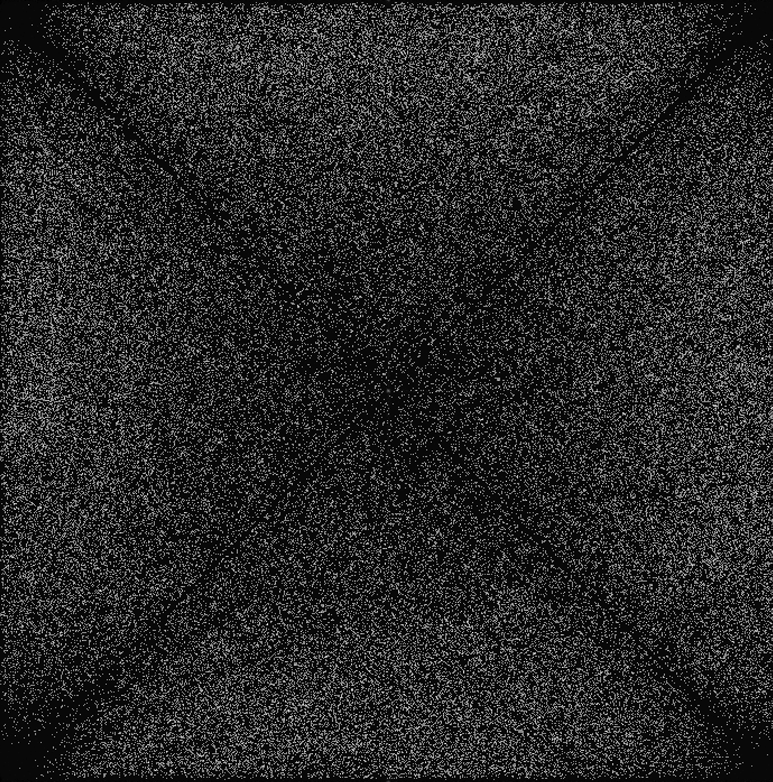

# Fibonacci Heap Graph Algorithms
### Optimizing Dijkstra's Shortest Path & Prim's Minimum Spanning Tree  
 
_A randomly generated connected, undirected, weighted graph at three levels of magnification. Written in .DOT and visualized using the open-source graphing utility Gephi. |V| = 5 x 104 and |E| = 1 x 109_ 

In 1984, Michael L. Fredman and Robert E. Tarjan proposed a data structure they called a Fibonacci heap: a forest of heap-ordered trees, which they suggested could implement a priority queue and achieve the best-known time-complexity for certain operations. Notably, a method to decrease the key associated with a particular node in amortized constant time. This is a significant optimzation for problems involving dense graphs; In the worst-case, this method is called once for every e in E during the "Relaxation" phase in the most common variants of both Dijkstra and Prim's algorithms. 

Despite its theoretical improvement over a binary heap priority queue, the constant factors and space-complexity associated with the Fibonacci heap have marred it with a reputation for being impractical. As Cormen et. al note in _Introduction to Algorithms_, Fibonacci heaps are "predominantly of theoretical interest." However, over the course of this project I found that Fibonacci heaps are of empirical use in optimizing tree algorithms for graphs where |E| is significantly larger than |V|. I also found Fibonacci heaps far easier to implement in a modern programming environment than their reputation would suggest. You'll find a brief overview of my implementation below, as well as my analysis of the asymptotic behavior we should expect. (Including an amortized analysis of the Fibonacci heap using the potential function given by Cormen et. al.)

### Graph Representation

My graphs are implemented as an adjacency list. Each vertex corresponds with an index in an array where a singly-linked list stores its incident edges. If you're unfamiliar with data structures for graphs, you can read about the difference between an adjacency list and an adjacency matrix [here](https://www.geeksforgeeks.org/comparison-between-adjacency-list-and-adjacency-matrix-representation-of-graph/). If you're unfamiliar with graph theory, you can read about graphs [here](https://en.wikipedia.org/wiki/Graph_(discrete_mathematics)).
